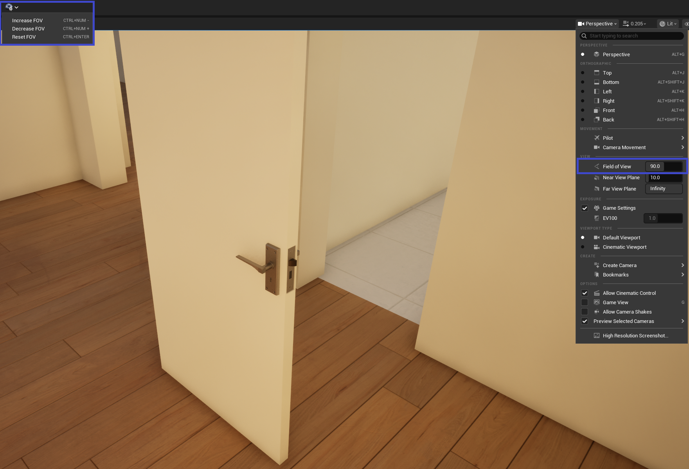
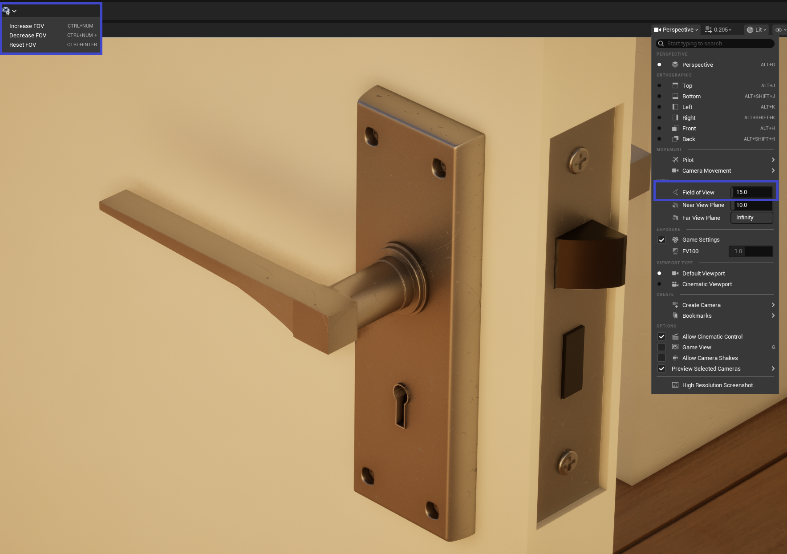
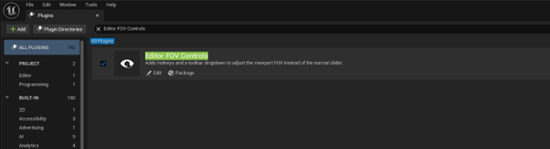

# Editor FOV Controls

## Overview
Editor FOV Controls adds hotkeys and a toolbar dropdown to adjust the viewport Field of View (FOV) in Unreal Editor.  
Instead of dragging the default slider, you can quickly increase, decrease, or reset FOV using keyboard shortcuts or toolbar options.

---

## Installation
1. Copy the `EditorFOVControls` folder into your project’s `Plugins/` directory.  
   Path: `YourProject/Plugins/EditorFOVControls/`  
2. Launch Unreal Editor.  
3. Enable **Editor FOV Controls** in the Plugin Manager.  
4. Restart the editor if prompted.

---

## Usage
### Hotkeys
- **Ctrl + Numpad –** → Increase FOV  
- **Ctrl + Numpad +** → Decrease FOV  
- **Ctrl + Enter** → Reset FOV to default (90°)

### Toolbar Dropdown
- A new **FOV Controls** dropdown appears in the main toolbar.  
- Select preset values (e.g. 80, 90, 100) directly from the menu.  

---

## Screenshots

High FOV:  

Low FOV:  

Plugin Enabled:  

---

## Features
- Quick FOV adjustments without using the slider.  
- Remappable hotkeys for workflow flexibility.  
- Toolbar integration for easy access.  
- Lightweight, editor‑only plugin (no runtime dependencies).  

---

## Compatibility
- Tested with Unreal Engine **5.6** and **5.7**.  
- Future updates will expand compatibility as new engine versions release.  

---

## Support
For questions or feedback, please use the Marketplace support form or contact the creator directly.  
(If GitHub Issues are enabled, link: [Report Issues](https://github.com/ScReAm-7-7-7/EditorFOVControls/issues))

---

## Credits
Created by **Rinus / ScReAm_7_7_7**
